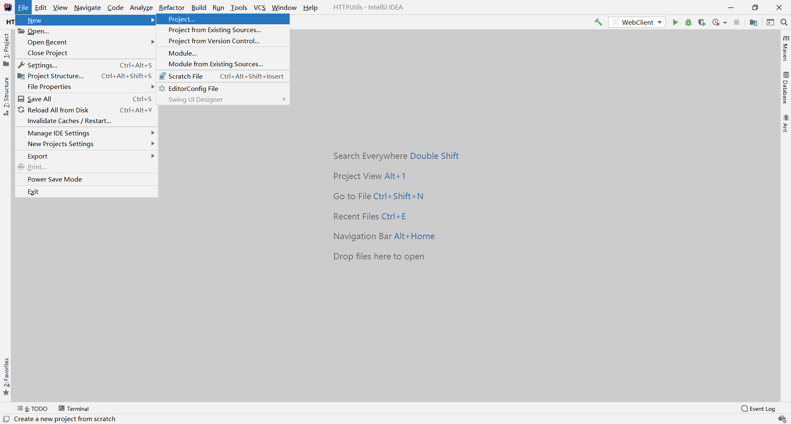
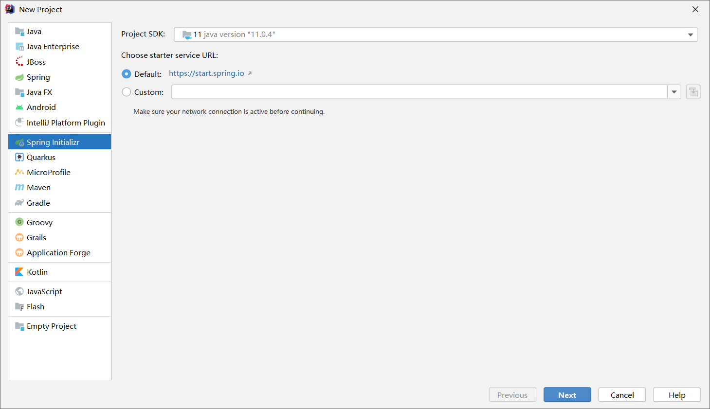
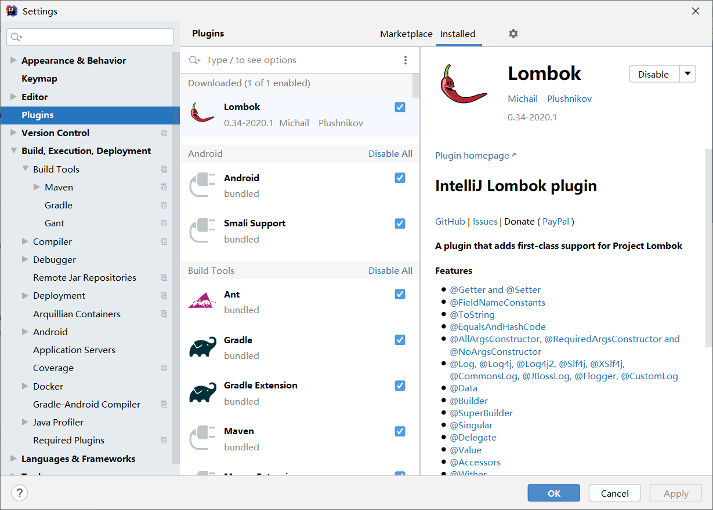

# 环境准备

 [user.sql](data\user.sql) 

具体配置见  [application.properties](code\src\main\resources\application.properties) 

# 具体步骤

## 创建 springboot 工程

选择 `Spring Initializr` ,剩下的一路 `next`





## 导入 MyBatis-Plus 依赖

[pom.xml](code/pom.xml)

```xml
        <!--mybatis-plus-->
        <dependency>
            <groupId>com.baomidou</groupId>
            <artifactId>mybatis-plus-boot-starter</artifactId>
            <version>3.0.5</version>
        </dependency>

        <!--mysql-->
        <dependency>
            <groupId>mysql</groupId>
            <artifactId>mysql-connector-java</artifactId>
        </dependency>
```

### 安装 Lombok

[pom.xml](code/pom.xml)

```xml
    <!--lombok用来简化实体类-->
    <dependency>
        <groupId>org.projectlombok</groupId>
        <artifactId>lombok</artifactId>
    </dependency>
```

添加 Lombok 注解可以让你不写 `getter` 、`setter` 等方法，使你开发更高效



## 数据库连接配置

 [application.properties](code\src\main\resources\application.properties) 

```properties
spring.datasource.driver-class-name=com.mysql.cj.jdbc.Driver
spring.datasource.url=jdbc:mysql://localhost:3306/mybatis_plus?serverTimezone=GMT%2B8&characterEncoding=utf-8
spring.datasource.username=root
spring.datasource.password=root
```

- `serverTimezone=GMT%2B8`：设置东八区
- `characterEncoding=utf-8`：解决中文乱码

## 编写实体类

 [User.java](code\src\main\java\com\example\demo\entity\User.java) 

- `@Data`：Lombok 注解，自动帮你生成 getter、setter 等方法

## 编写mapper

  [UserMapper.java](code\src\main\java\com\example\demo\mapper\UserMapper.java) 

- `extends BaseMapper<User>`：继承 `BaseMapper<T>`，你就可以使用 mybatis-plus 提供的一系列方法
- `@Repository`：交给 spring 管理

## 扫描mapper

 [MpConfig.java](code\src\main\java\com\example\demo\config\MpConfig.java) 

- `@Configuration`：说明这是一个配置类
- `@MapperScan`：扫描 mapper 所在的包，不然 spring 找不到 mapper

## 测试

 [DemoApplicationTests.java](code\src\test\java\com\example\demo\DemoApplicationTests.java) 

到了这一步其实就算完成了，直接运行 `DemoApplicationTests.findAll()`  即可见 user 表所有数据

### mybatis 日志

 [application.properties](code\src\main\resources\application.properties) 

```properties
#mybatis日志
mybatis-plus.configuration.log-impl=org.apache.ibatis.logging.stdout.StdOutImpl
```

开启 mybatis 日志可以让你看到更多查询信息，建议加上


