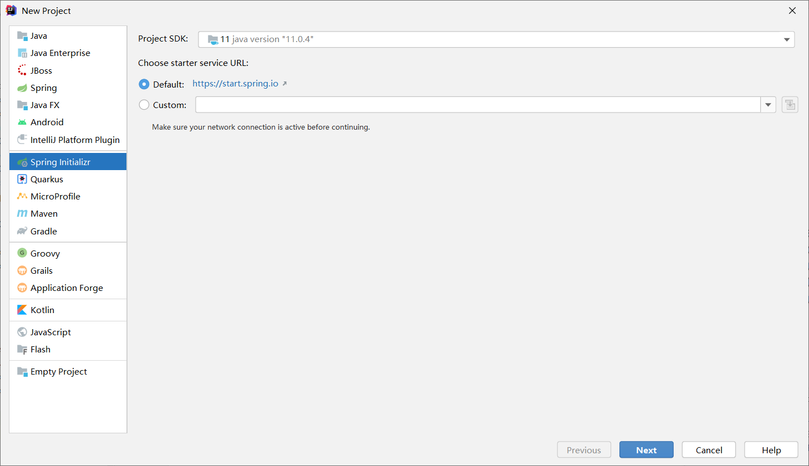
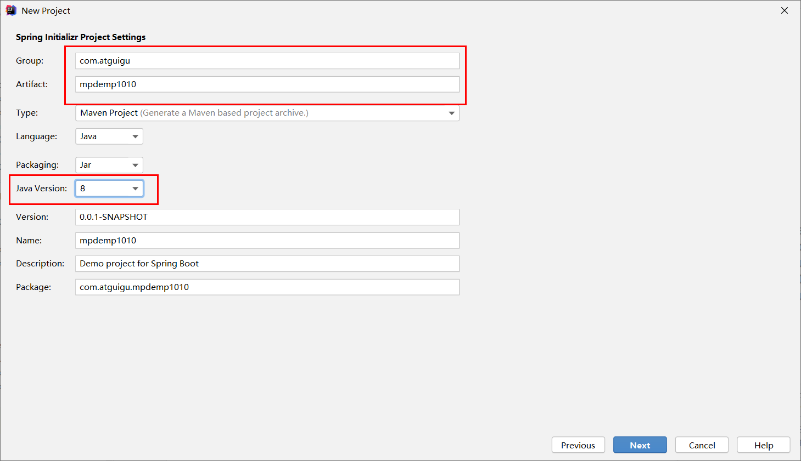
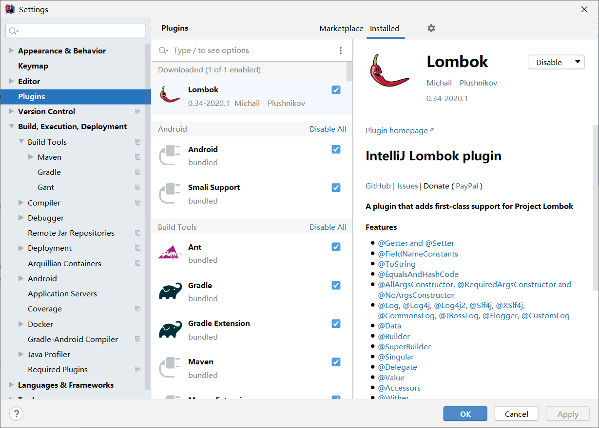

# 准备数据库

具体见  [application.properties](mpdemo1010\src\main\resources\application.properties) 

```mysql
DROP TABLE IF EXISTS user;

CREATE TABLE user
(
	id BIGINT(20) NOT NULL COMMENT '主键ID',
	name VARCHAR(30) NULL DEFAULT NULL COMMENT '姓名',
	age INT(11) NULL DEFAULT NULL COMMENT '年龄',
	email VARCHAR(50) NULL DEFAULT NULL COMMENT '邮箱',
	PRIMARY KEY (id)
);
DELETE FROM user;

INSERT INTO user (id, name, age, email) VALUES
(1, 'Jone', 18, 'test1@baomidou.com'),
(2, 'Jack', 20, 'test2@baomidou.com'),
(3, 'Tom', 28, 'test3@baomidou.com'),
(4, 'Sandy', 21, 'test4@baomidou.com'),
(5, 'Billie', 24, 'test5@baomidou.com');
```

# 创建 springboot 工程

除了这两个，剩下的随意





## 修改版本

项目用的是 `2.2.1.RELEASE` 这里我们跟项目保持一致

[pom.xml](mpdemo1010/pom.xml)

```xml
    <parent>
        <groupId>org.springframework.boot</groupId>
        <artifactId>spring-boot-starter-parent</artifactId>
        <version>2.2.1.RELEASE</version>
        <relativePath/> <!-- lookup parent from repository -->
    </parent>
```

# 安装 Lombok

添加 Lombok 注解可以让你不写 `getter` 、`setter` 等方法，使你开发更高效

[pom.xml](mpdemo1010/pom.xml)

```xml
    <!--lombok用来简化实体类-->
    <dependency>
        <groupId>org.projectlombok</groupId>
        <artifactId>lombok</artifactId>
    </dependency>
```


# 导入 MyBatis-Plus 依赖

[pom.xml](mpdemo1010/pom.xml)

```xml
        <!--mybatis-plus-->
        <dependency>
            <groupId>com.baomidou</groupId>
            <artifactId>mybatis-plus-boot-starter</artifactId>
            <version>3.0.5</version>
        </dependency>

        <!--mysql-->
        <dependency>
            <groupId>mysql</groupId>
            <artifactId>mysql-connector-java</artifactId>
        </dependency>
```

# 数据库连接配置

 [application.properties](mpdemo1010\src\main\resources\application.properties) 

```properties
spring.datasource.driver-class-name=com.mysql.cj.jdbc.Driver
spring.datasource.url=jdbc:mysql://localhost:3306/mybatis_plus?serverTimezone=GMT%2B8
spring.datasource.username=root
spring.datasource.password=root
```

# 编写实体类

 [User.java](mpdemo1010\src\main\java\com\atguigu\mpdemo1010\entity\User.java) 

# 编写mapper

 [UserMapper.java](mpdemo1010\src\main\java\com\atguigu\mpdemo1010\mapper\UserMapper.java) 

# 扫描mapper

 [Mpdemo1010Application.java](mpdemo1010\src\main\java\com\atguigu\mpdemo1010\Mpdemo1010Application.java) 

```java
@MapperScan("com.atguigu.mpdemo1010.mapper")
```

# 测试

 [Mpdemo1010ApplicationTests.java](mpdemo1010\src\test\java\com\atguigu\mpdemo1010\Mpdemo1010ApplicationTests.java) 