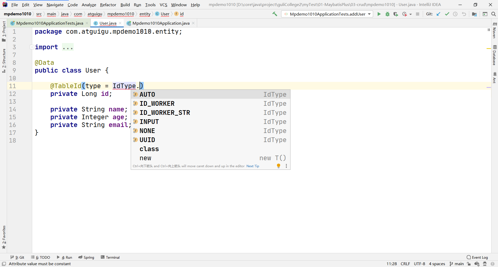

# MyBatis-Plus 主键生成策略介绍

## 常用策略

```java
@TableId(type = IdType.ID_WORKER) //mp自带策略，生成19位值，数字类型使用这种策略，比如long
@TableId(type = IdType.ID_WORKER_STR) //mp自带策略，生成19位值，字符串类型使用这种策略
```

## 默认策略

```java
@TableId(type = IdType.ID_WORKER) //mp自带策略，生成19位值，数字类型使用这种策略，比如long
```

## 可用策略



## 参考

 [分布式系统唯一ID生成方案汇总 - nick hao - 博客园.html](references\分布式系统唯一ID生成方案汇总 - nick hao - 博客园.html) 

# 具体步骤

## 前置操作

1. 准备数据库 [user.sql](data\user.sql) 
2. 创建 springboot 工程
3. 导入依赖 [pom.xml](code\pom.xml) 
4. 数据库连接配置 [application.properties](code\src\main\resources\application.properties) 
5. 编写实体类 [User.java](code\src\main\java\com\example\demo\entity\User.java) 
6. 编写 mapper  [UserMapper.java](code\src\main\java\com\example\demo\mapper\UserMapper.java) 
7. 扫描 mapper  [MpConfig.java](code\src\main\java\com\example\demo\config\MpConfig.java) 

## 使用方法

在主键上方添加注解 `@TableId`，选择合适的策略即可：

 [User.java](code\src\main\java\com\example\demo\entity\User.java) 

```java
@TableId(type = IdType.ID_WORKER)
private Long id;
```

## 测试

 [DemoApplicationTests.java](code\src\test\java\com\example\demo\DemoApplicationTests.java) 

```java
    @Test
    public void insert() {
        User user = new User();
        userMapper.insert(user);
    }
```

查看数据库可见：插入的数据按照主键生成策略自动生成了主键

# 作者的话

这个主键生成策略别搞了，知道这回事就行，使用 mybatis-plus 默认配置就挺不错


