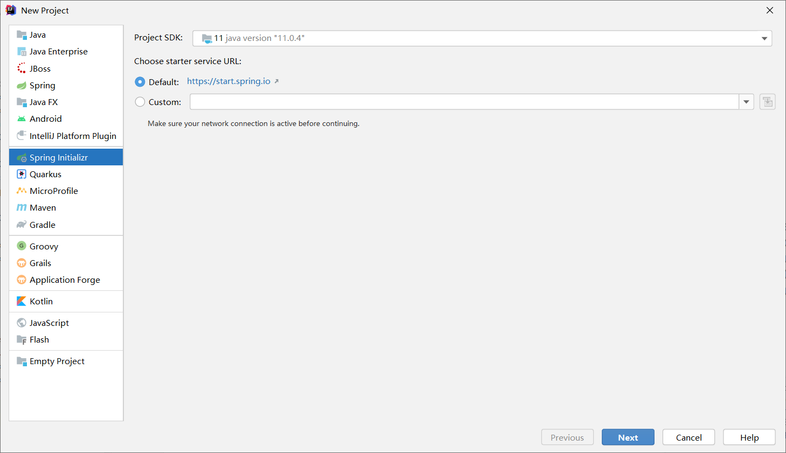
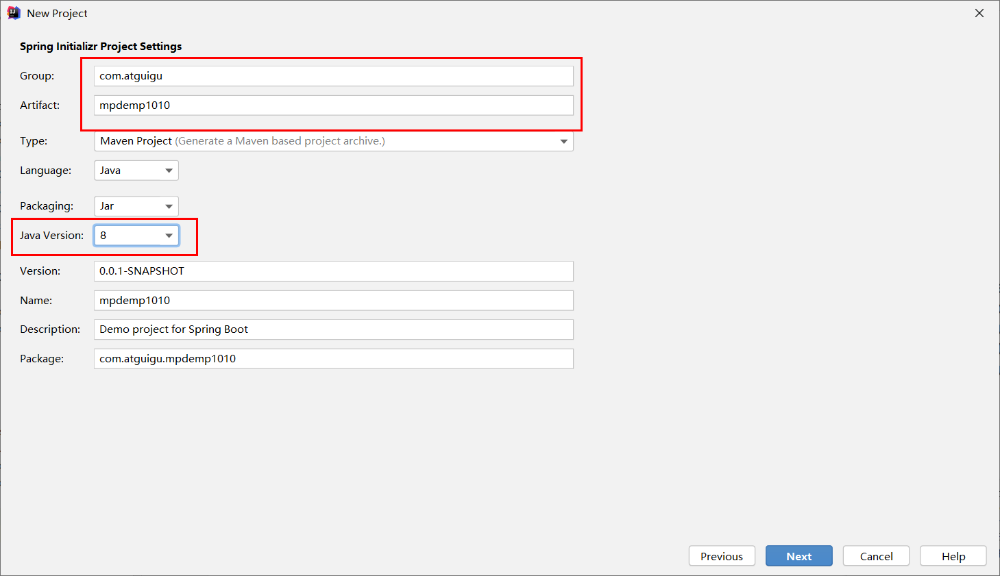

# MyBatis-Plus

官网： https://mp.baomidou.com/guide/

# 创建工程

除了这两个，剩下的随意





# 修改版本

项目用的是 `2.2.1` 这里我们跟项目保持一致

[pom.xml](mpdemo1010/pom.xml)

```xml
    <parent>
        <groupId>org.springframework.boot</groupId>
        <artifactId>spring-boot-starter-parent</artifactId>
        <version>2.2.1</version>
        <relativePath/> <!-- lookup parent from repository -->
    </parent>
```


