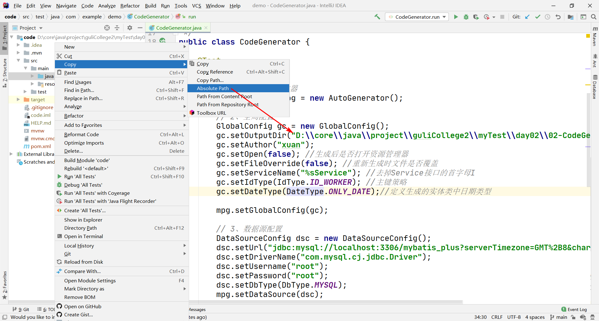
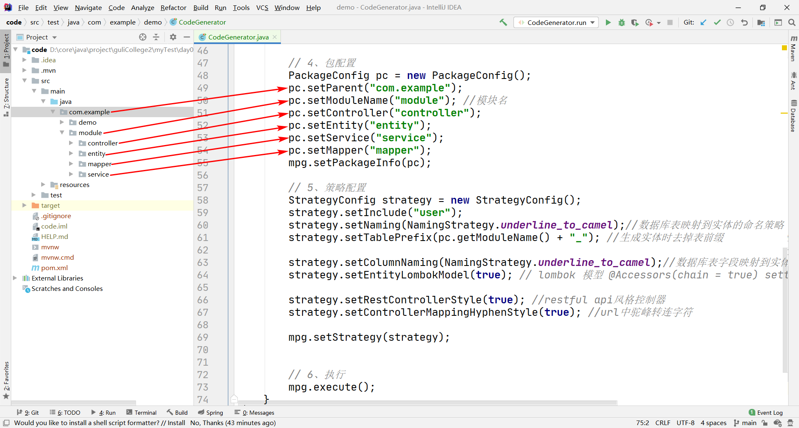

# 环境准备

## MySQL 数据库

 [user.sql](data\user.sql) 

具体见下面的数据源配置

# 具体步骤

## 创建 springboot 工程

使用 `Spring Initializr` 创建

## 导包

 [pom.xml](code\pom.xml) 

##  [CodeGenerator.java](code\src\test\java\com\example\demo\CodeGenerator.java) 参数配置

### 输出路径

这里用绝对路径就肯定没错，我们输出到 [java](code/src/main/java) 



### 数据源配置

```java
        dsc.setUrl("jdbc:mysql://localhost:3306/mybatis_plus?serverTimezone=GMT%2B8&characterEncoding=utf-8");
        dsc.setDriverName("com.mysql.cj.jdbc.Driver");
        dsc.setUsername("root");
        dsc.setPassword("root");
        dsc.setDbType(DbType.MYSQL);
```

### 包配置

指定 controller、entity、service、service 路径

```java
        pc.setParent("com.example");
        pc.setModuleName("module"); //模块名
        pc.setController("controller");
        pc.setEntity("entity");
        pc.setService("service");
        pc.setMapper("mapper");
```



### 策略配置

指定要生成代码的表

```java
        strategy.setInclude("user");
```

### 其他配置

其他配置保持不变就可以了

# 包扫描

代码生成完毕，别忘了 `@MapperScan` 扫描 mapper 所在的包

